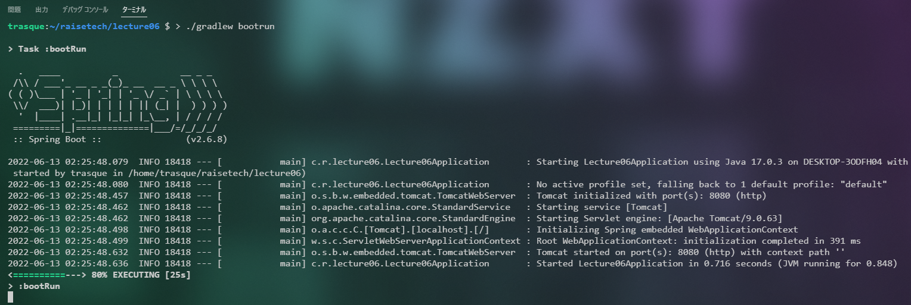
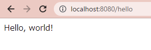
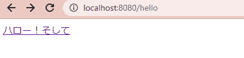

# 課題6

## 基本課題

SpringWebでLocalhost:8080に `Hello, world!` を表示する。  
エンドポイントは `/hello` とする。

### 実行環境

- Gradle Project
- Spring Boot 2.6.8
- Java 17
- Dependencies
  - Spring Web

### 実行内容

1. レポジトリをクローン
2. `./gradle build` でビルド
3. `./gradle bootRun` でAPサーバーを起動
4. ブラウザで `localhost:8080/hello` にアクセスする

## 追加課題

エンドポイント `/hello` にアクセスすると、リンク付きのテキストが表示される。  
このリンクには `/hello?requestParam=1` のようなパラメータが含まれている。  
順次 `requestParam=8` まで変化したテキストリンクを表示する。  
最終的には `/hello` にアクセスしたのと同様の状態に戻る。  
`requestParam=` が `0 ~ 8` 以外の場合はすべて初期状態を表示する。

### 実行内容

