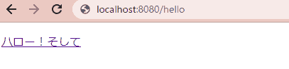

# 課題6

## 基本課題

SpringWebでLocalhost:8080に `Hello, world!` を表示する。  
エンドポイントは `/hello` とする。

### 実行環境

- Gradle Project
- Spring Boot 2.6.8
- Java 17
- Dependencies
  - Spring Web

### 実行内容

1. レポジトリをクローン
2. `./gradle build` でビルド
3. `./gradle bootrun` でAPサーバーを起動
4. ブラウザで `localhost:8080/hello` にアクセスする

## 追加課題

エンドポイントを複数作り、順次リンクを辿っていく構成とする。

### 実行内容

